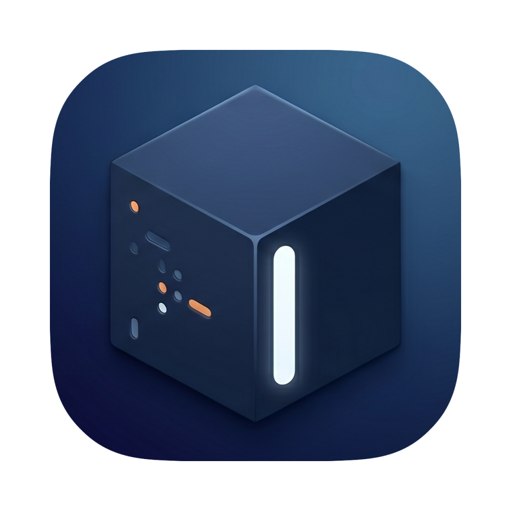
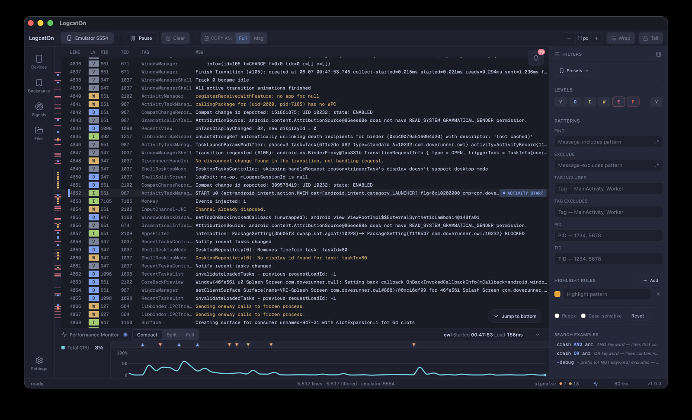
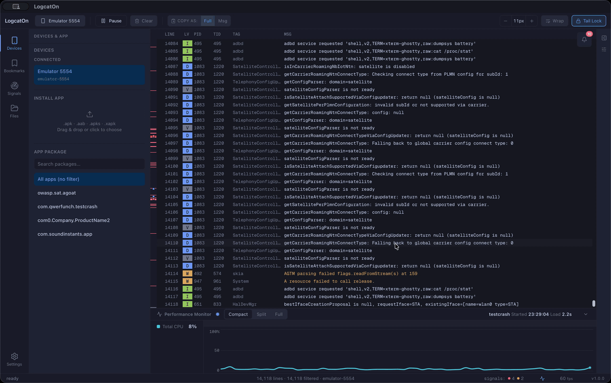
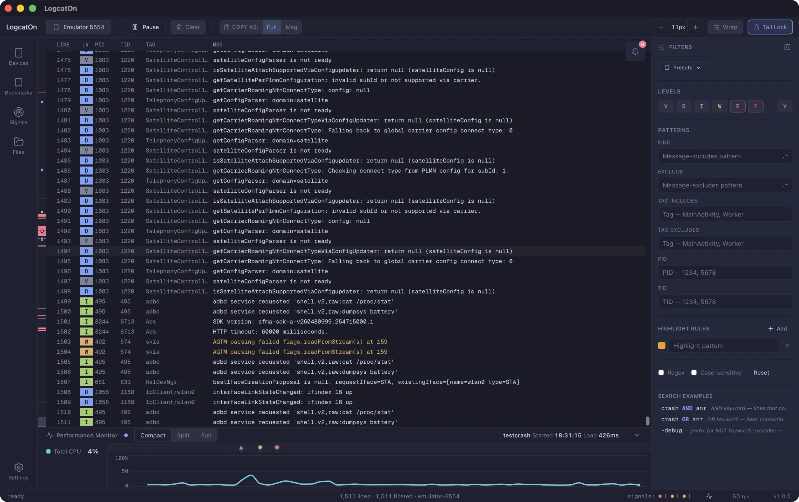
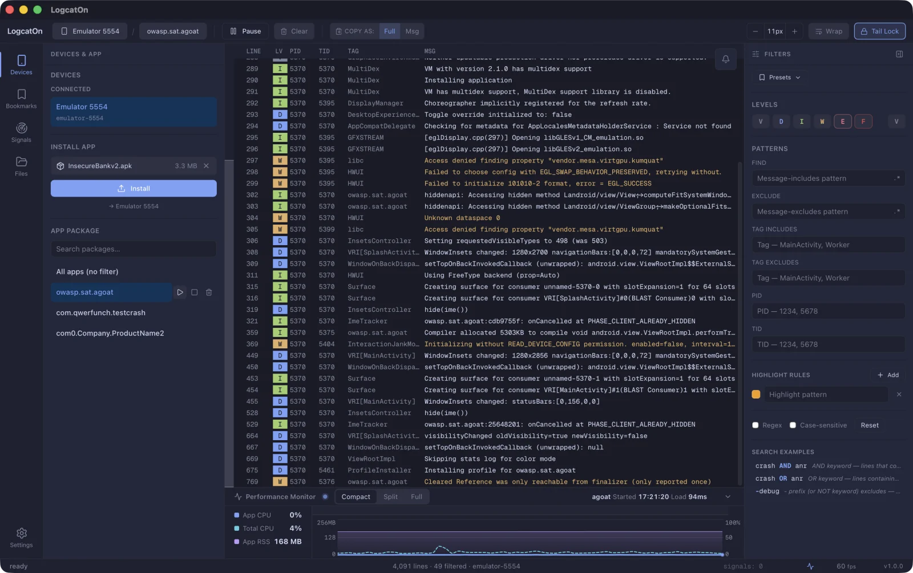
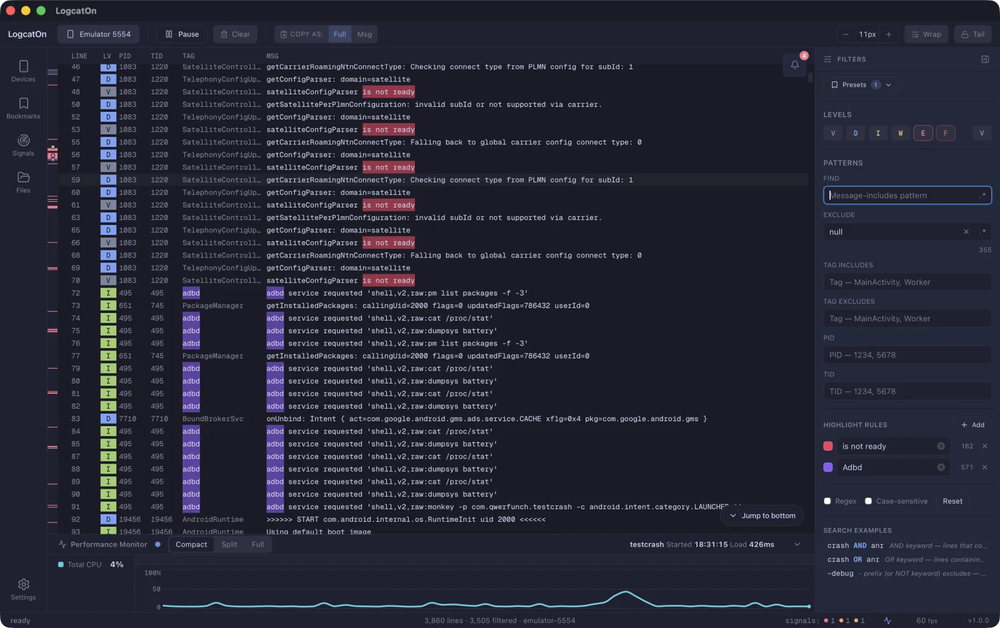
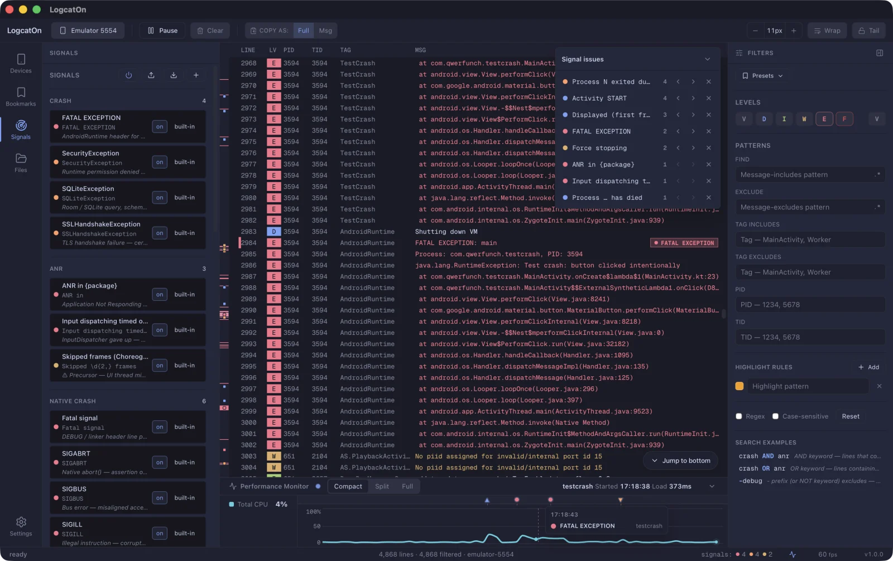
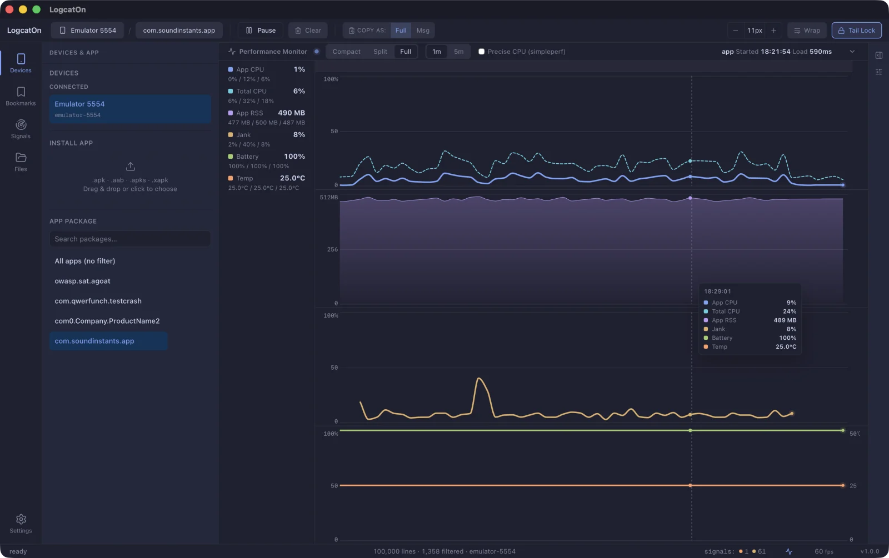
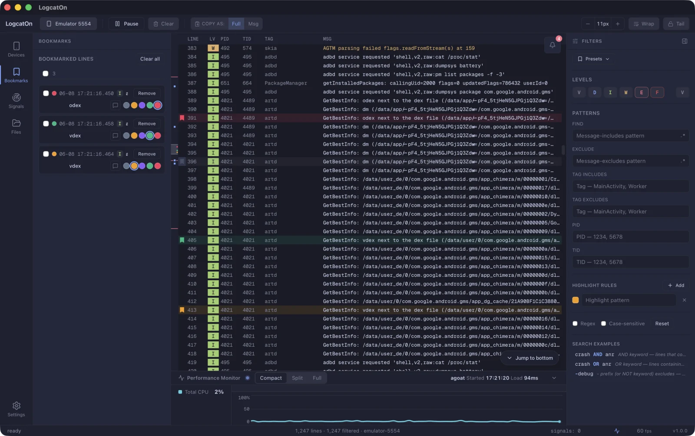
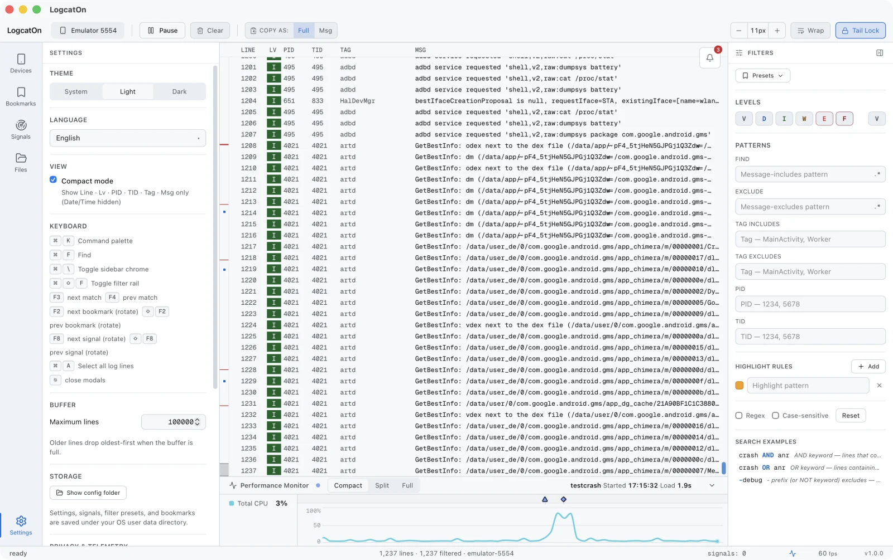

  

<h1 align="center">LogcatOn</h1>

  <strong>Blazing-fast Android logcat viewer for macOS · Windows · Linux</strong> 
  Pick your app — the noise disappears.

  
  
  
  
  

  <a href="https://qwerfunch.github.io/logcat-on-releases/"><strong>⬇️ Download</strong></a>
  ·
  <a href="https://github.com/qwerfunch/logcat-on-releases/releases">All releases</a>
  ·
  <a href="https://github.com/qwerfunch/logcat-on-releases/issues/new/choose">Report an issue</a>

## Why LogcatOn?

LogcatOn is built to be fast and to get you to the crash immediately. It stays smooth even under heavy log volume, and every signal — gutter strip, minimap dot, issues tray — is one click from jumping straight to the line that caused it.

<em>A crash lands — gutter strip, inline pill, minimap dot, and the issues tray light up in real time.</em>

| Feature | What it does |
|---|---|
| **Auto package filter** | Pick an app — only its PID/TID lines pass, re-binding automatically when the app restarts |
| **Signal catalog** | 32+ built-in patterns (crash · ANR · native fault · memory · lifecycle) highlighted via gutter strip, inline pill, minimap dot, and issues tray — click any of them to jump straight to the line, and Crash Triage surfaces the likely cause, stack frame, and next steps automatically — custom signals supported |
| **Smart search & live filters** | 7-field filter panel, log-level toggles, AND/OR/NOT queries, quoted phrases, `-exclusion`, regex mode with logcat-friendly presets |
| **Bookmarks & notes** | One-key toggle, color tags, jump cycling, persistent across sessions, export |
| **1M-line sessions** | A ring buffer + virtualized rendering — only the visible rows are painted, the way VS Code's editor does it |
| **Device tools** | Install APK/AAB/XAPK by drag & drop, launch / force-stop / uninstall per app, performance monitor (CPU · memory · jank) with a signal timeline |
| **File mode** | Open `.log`/`.txt`, save filtered or raw |
| **English & Korean UI** | Follows your OS language, switchable in Settings |
| **Log line detail** | Double-click any line for readable JSON, stack trace, XML, and URL formatting |
| **Agent Port** | Connect an AI coding assistant to your live logs, crashes, and metrics over MCP — it jumps straight to the relevant line |
| **Session Capsules** | Package logs, bookmarks, filters, signals, and device details into one shareable `.logcaton` file |
| **Jump to time** | `⌘K` (`Ctrl+K`) → *Jump to time* to jump to a device timestamp or filter by a time range |

All of it free for personal and commercial use — see [License](#license).

<strong>📸 More screenshots</strong>

**Smooth to scroll, easy on the eyes**

**Only the app you care about**

**Narrow down to the lines you want**

**Crashes catch your eye, instantly**

**Performance, live at a glance**

**Never lose the line that matters**

**Dark or light — make it yours**

## Install

Grab the build for your OS from the **[release page](https://qwerfunch.github.io/logcat-on-releases/)** (or the [Releases](https://github.com/qwerfunch/logcat-on-releases/releases) tab):

| Platform | Installer | Portable |
|---|---|---|
| macOS (Universal — Intel / Apple Silicon) | `LogcatOn_*.dmg` | `LogcatOn-*-macos-universal-portable.tar.gz` |
| Windows (x64) | `LogcatOn_*_x64-setup.exe` · `LogcatOn_*_x64_en-US.msi` | `LogcatOn-*-windows-x64-portable.zip` |
| Linux (x64) | `LogcatOn_*_amd64.AppImage` · `.deb` · `.rpm` | `LogcatOn-*-linux-x64-portable.tar.gz` |

> **Unsigned builds** — releases are not yet code-signed, so your OS will warn on first launch:
> **macOS**: right-click the app → *Open* (needed once) · **Windows**: SmartScreen → *More info* → *Run anyway*

### Requirements

- An Android device with USB debugging enabled, or an emulator (Android Studio AVD, Genymotion, …)

> No Android SDK required — ADB and platform-tools are bundled. (If you already have ADB installed, yours is used automatically.)

### Getting started

1. **Launch** LogcatOn and plug in your device (or start an emulator).
2. **Pick your app** from the package picker — the noise disappears, and the filter re-binds automatically when the app restarts.
3. **Follow the signals** — crashes, ANRs, and native faults are already highlighted in the gutter, minimap, and issues tray.

## Feedback & Issues

The source repository is private — **this repo is the official issue tracker** for LogcatOn.

- 🐛 [Report a bug](https://github.com/qwerfunch/logcat-on-releases/issues/new?template=bug_report.yml)
- 💡 [Request a feature](https://github.com/qwerfunch/logcat-on-releases/issues/new?template=feature_request.yml)

When reporting a bug, please include your OS + version, the LogcatOn version (release tag), and steps to reproduce. Logs and screenshots help a lot.

## License

Free for personal and commercial use. Closed-source, distributed under a proprietary EULA — redistribution, resale, and reverse engineering are not permitted. Full text: [LICENSE](LICENSE).

Bundled third-party open-source components (Android platform-tools/adb · aapt2 · bundletool · fonts, …) are listed with their licenses in [THIRD-PARTY-NOTICES.md](THIRD-PARTY-NOTICES.md).

## Built with

LogcatOn is developed with [cladding](https://github.com/qwerfunch/cladding) — the integrity layer for AI-coded software: spec-driven, drift-aware, iron-clad.

---

<strong>For maintainers — how this repo works</strong>

This repository is the public release hub + website for LogcatOn:

- **Releases** are published here by the private source repo's CI (tag push → multi-platform build → draft release with assets → manual publish).
- **Website** (GitHub Pages): every release event, push to `main`, and a daily cron run [`deploy.yml`](.github/workflows/deploy.yml) — it bakes this repo's releases into `releases.json` ([`scripts/build-releases.mjs`](scripts/build-releases.mjs)), prerenders release notes + sitemap for SEO ([`scripts/prerender.mjs`](scripts/prerender.mjs)), and deploys `dist/` to Pages.
- **Local preview**: `python3 -m http.server 8000` from the repo root (the page falls back to `data/releases.sample.json`), or run the build scripts with `GITHUB_TOKEN=$(gh auth token)`.
- `LICENSE` and `THIRD-PARTY-NOTICES.md` are mirrored from the source repo — re-sync when they change there.

